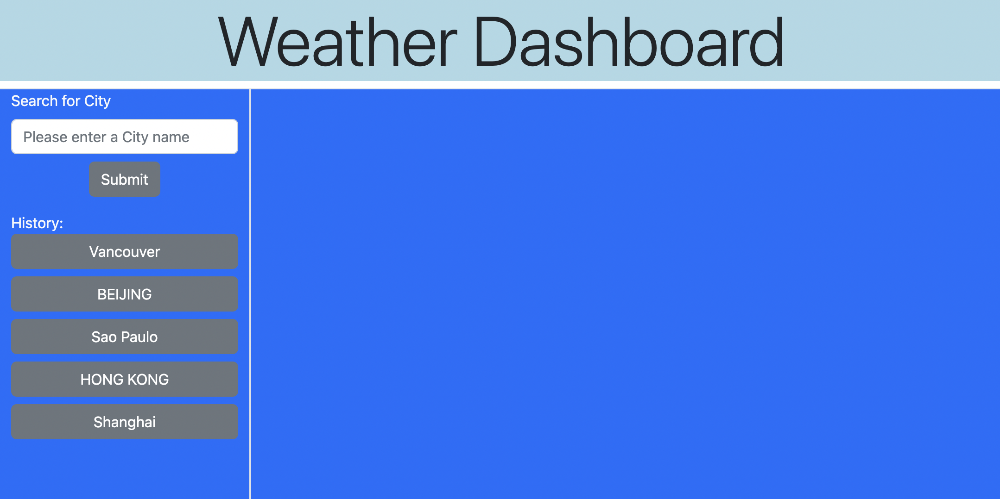
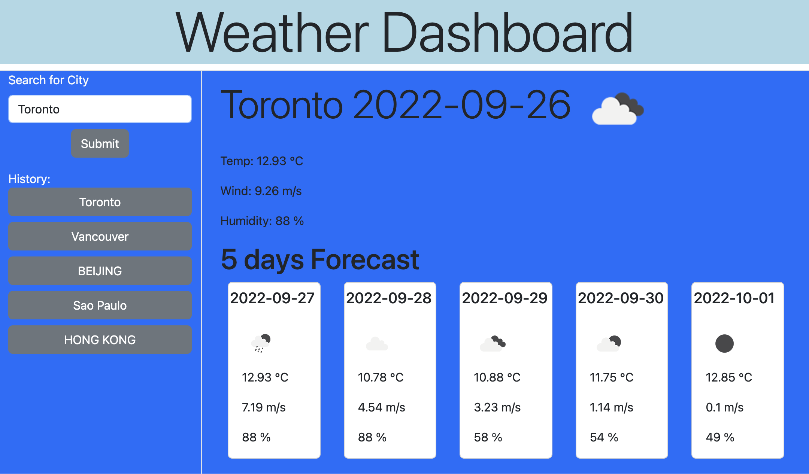

# Weather-Dashboard

## Description

This project is to build  a weather dashboard to show current and future 5-day weather forecast of a city.
## Installation

N/A

## Usage

visit application URL: https://benliu104.github.io/Weather-Dashboard/

Dashboard webpage will save your searching history if you have ever used it.

Enter a City name and basic weather information (temperature, wind speed and humidity) will be shown

## Credits

Ben Liu: https://github.com/BenLiu104

## License

Please refer to the LICENSE in the repo.